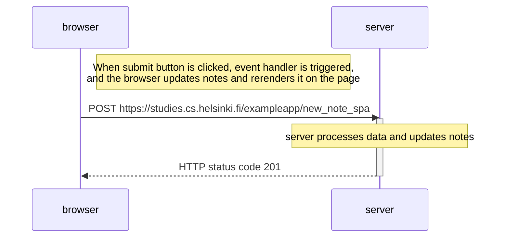

```mermaid
sequenceDiagram
    participant browser
    participant server 

    Note right of browser: When submit button is clicked, event handler is triggered,<br/>and the browser updates notes and rerenders it on the page
    browser->>server: POST https://studies.cs.helsinki.fi/exampleapp/new_note_spa
    activate server
    Note over server: server processes data and updates notes
    server-->>browser: HTTP status code 201
    deactivate server


```